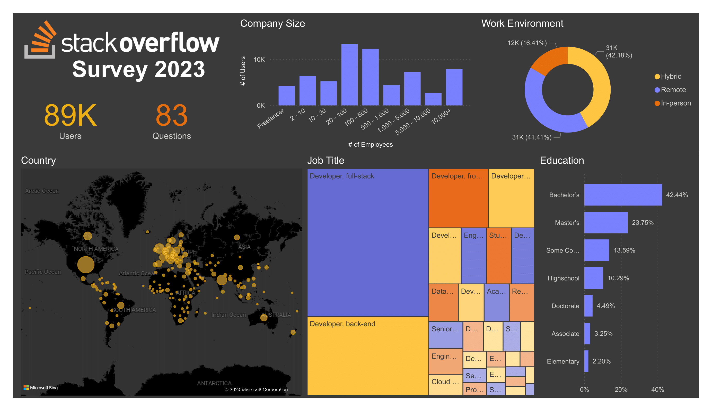
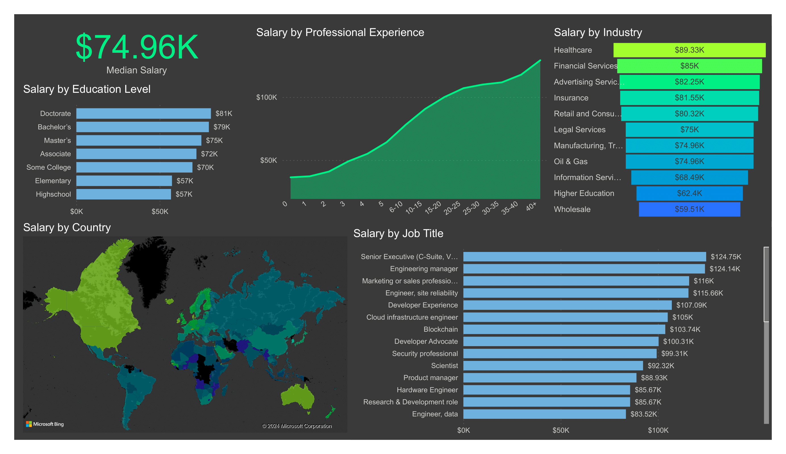
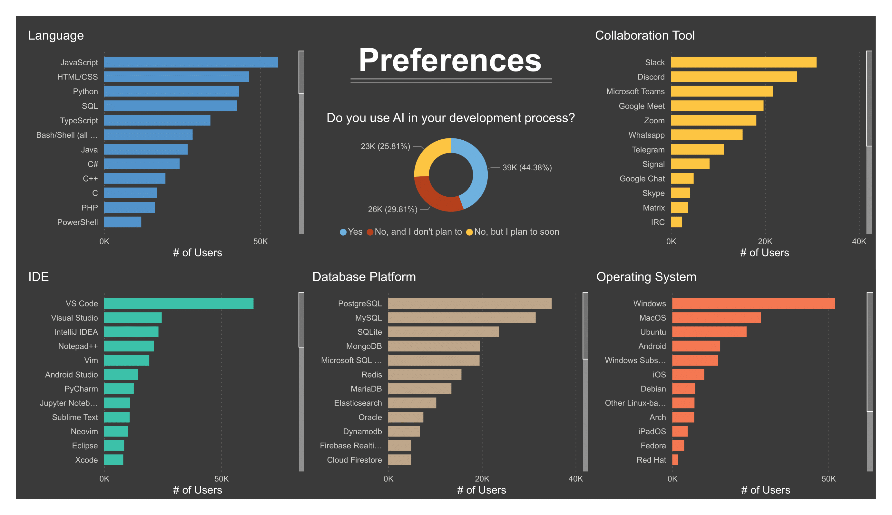

# Stack Overflow Survey Dashboard
Using Power BI, I created a dashboard visualizing the responses of the 2023 Stack Overflow developer survey. In particular, I looked at demographics, salaries, and technology preferences.

## Dashboard

## Data
You can download the Stack Overflow survey data [here](https://survey.stackoverflow.co/).
